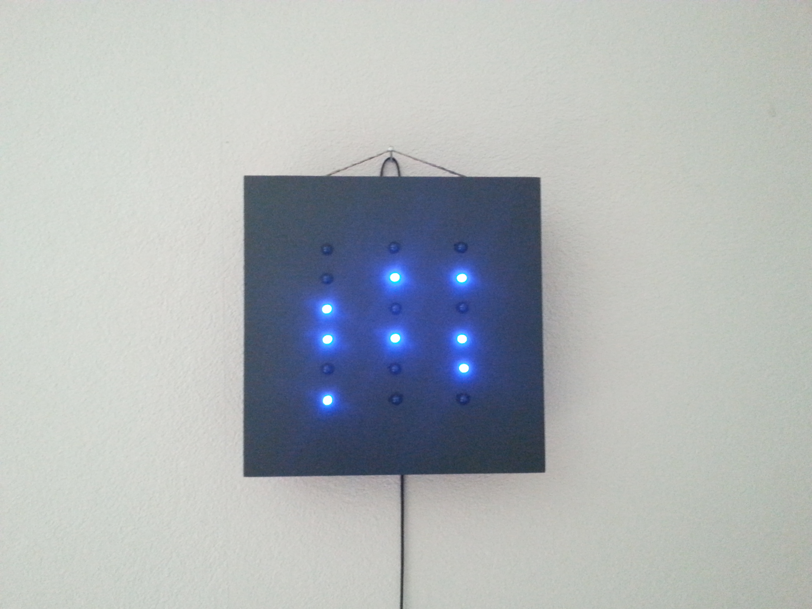

Arduino Binary Clock
====================

## IDE

* [Arduino Software][3]

## Libraries

* [RTClib][4] 

## Datasheet

* [ATmega328P][21] 
* [DS1307][22]
* [PCF8563][23]
* [74HC595][24]
* [CD4021B][25]

## Links

* [ShiftOut][11]
* [ShiftIn][12]
* [RTC DS1307][13]
* [RTC PCF8563][14]
* [DCF77][15]

## Creator

**Stefan Hüsges**

:computer: [Homepage][1]

:octocat: [GitHub][2]

## License

[MIT License](LICENSE)

[1]: http://www.mpcx.net
[2]: https://github.com/tronsha

[3]: https://www.arduino.cc/en/Main/Software
[4]: https://github.com/adafruit/RTClib

[11]: https://www.arduino.cc/en/Tutorial/ShiftOut
[12]: https://www.arduino.cc/en/Tutorial/ShiftIn
[13]: https://learn.adafruit.com/ds1307-real-time-clock-breakout-board-kit/overview
[14]: http://playground.arduino.cc/Main/RTC-PCF8563
[15]: http://playground.arduino.cc/Code/DCF77

[21]: http://www.atmel.com/Images/Atmel-8271-8-bit-AVR-Microcontroller-ATmega48A-48PA-88A-88PA-168A-168PA-328-328P_datasheet_Summary.pdf
[22]: http://datasheets.maxim-ic.com/en/ds/DS1307.pdf
[23]: http://www.nxp.com/documents/data_sheet/PCF8563.pdf
[24]: http://www.ti.com/lit/ds/symlink/sn74hc595.pdf
[25]: http://www.ti.com/lit/ds/symlink/cd4021b.pdf
